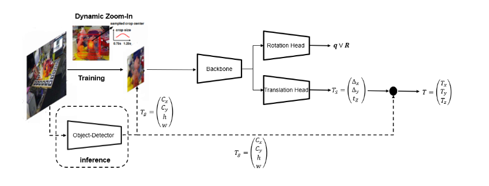

# Regpose: A PyTorch Implementation of the Regpose Framework for 6DoF Object Pose Estimation

### Introduction

In this project The 6DoF Pose estimation Network modified CDPN was implemented: 
Modified CDPN  is a two stage 6DoF pose estimation network. 
Modified CDPN, uses the extracted bounding boxes from an object detector (Reported results are from YOLOv4-CSP). The extracted image patch containing an object of interest is then passed into a backbone network and a translation and rotation head regressing both translation and rotation. The network comprises two heads, one regressing a 6D rotation representation from where the Rotation matrix can be obtained, or a Quat-Head regressing the quaternions.  The approach is motivated by Efficientdet [ICCV](https://openaccess.thecvf.com/content_ICCV_2019/papers/Li_CDPN_Coordinates-Based_Disentangled_Pose_Network_for_Real-Time_RGB-Based_6-DoF_Object_ICCV_2019_paper.pdf). The code was partially taken from [Project](https://github.com/LZGMatrix/CDPN_ICCV2019_ZhigangLi).

<p align="center"></p>
### Required environment

- Ubuntu 20.04
- PyTorch 1.9.0
- CUDA 10.0 

### Installation

Use python3.8.11
1. Install python packages
   ```Shell
   pip install -r requirement.txt
   ```
### Dataset and Code Structure
1. Download the YCB-Video dataset from [here](https://rse-lab.cs.washington.edu/projects/posecnn/).
2. Move the folder containing synthetic images into the folder images. 
3. Download VOC2012 Dataset and render synthetic images with VOC2012 background using syn_generator.py 
4. Put the Dataset in the Following Structure 

```
Root
├── CoCo_AnnotationYCB.py
|── syn_generator.py
|── keyframe.json (Test-json annotation File generated using CoCo_AnnotationYCB.py)
|── keyframe_yolo.json (Annotation File with predicted bounding boxes from YOLOv4-CSP)
|── train_synt.json (Train-json annotation File generated using CoCo_AnnotationYCB.py for egocentric rotation)
|── train_synt_alo.json (Train-json annotation File generated using CoCo_AnnotationYCB.py for allocentric rotation)
├── images 
│   ├─── 0000
│   │   └── 0001
    |   └── 0002
    |   └── ...
    |   └── data_syn
│   └── image_sets
│       ├── train.txt
│       │   ├── val.txt
│       │   └── keyframes.txt
|       |   └── ...
│       ├── models
│           ├── 002_master_chef_can
|           |   └── points.xyz
|           |   └── merged_cloud.ply
|           |   └── ...
│           └── 003_cracker_box
|           │   │
|           |   └── points.xyz
|           |   └── merged_cloud.ply
|           |   └── ...
│           └──  ....
|
|──Regpose 
   └──  tools
   └──  lib
   └──  Config-Files (includes Config Files for the two different heads)
   | 	└── 6D-Head 
   |    |	└── config_trans_rot.yaml (Config File for Fine Tuning)
   |    |	└──  config_rot.yaml (Config File to train, Backbone, rotation head)
   |    |	└── config_trans.yaml (Config File to train translation head)
   |    |	└── Config-Test.yaml (Config File for validation and testing)
   |	└── Quat-Head
   |     	└── config_trans_rot.yaml (Config File for Fine Tuning) 
   |     	└── config_rot.yaml (Config File to train, Backbone, rotation head)
   |     	└── config_trans.yaml (Config File to train translation head)
   |     	└── Config-Test.yaml (Config File for validation and testing)
   └──  exp (automatically built in running containing output models) 
   |
   └──Networks (Folder containing final weights to be downloaded)
    └──model_quat_ego.checkpoint
    └──model_rot6d-allo.checkpoint
    └──model_rot6d-ego.checkpoint
    └──model_quat_allo.checkpoint
    
```
5. run CoCo_AnnotationYCB.py to annotate YCB-Video Dataset. The annotation files are already provided.
6. download weights from (Networks Folder) from [here](https://drive.google.com/drive/folders/1hyw3M-jILGXPgsCfKftol9iQ869J8BQr?usp=sharing)
7. Download Annotation Files from [here](https://drive.google.com/drive/folders/1u2WSlYTJs5lFrS7_wYwDmB6Lz5oSpG5I?usp=sharing) and put them in source Folder (see Data Structure)
8. For training and test it needs to be speficied if allocentric or egocentric is going to be trained, evaluated by setting the variable in the config file train.rot_rep: 'allo'| 'ego'.

### Training Strategy

1. go to config.py in lib folder and chose the config file config_rot.yaml as configuration file to train  Backbone and rotation head (For training run main.py) for one of the rotation heads (run main.py). 
2. After training go to config.py in lib folder and chose the config file config_trans.yaml  to train translation, while chosing specifieng the output weights from previous training as input. (For training run main.py)
3. For fine-tuning go to config.py in lib folder and chose the config file config_trans_rot.yaml , while specifying the model to load in the config_trans_rot.yaml  as the outputet weights from the previous training step. 

### Testing or Validation 

1. go to config.py in lib folder and chose the config file config_Test.yaml as configuration file to test, choose the used network (e.g: ../Networks/model_quat_allo.checkpoint) to test the quat head architecture trained allocentricly.
2. run the model using main.py in tools folder.

